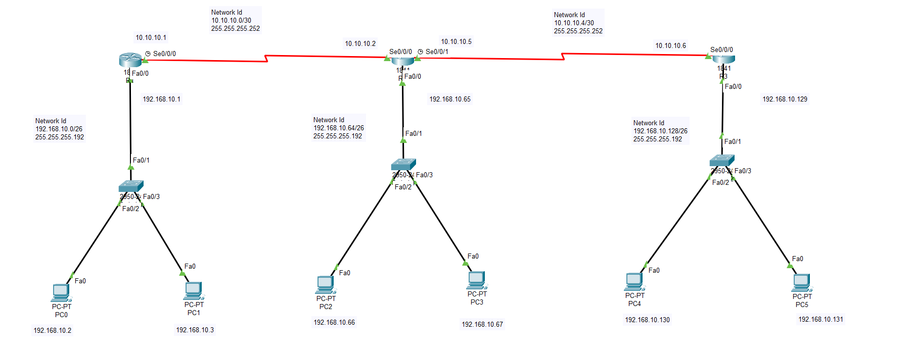

# RIPv2

Because of some drawbacks in RIP version 1, RIP version 2 (RIPv2) was introduced. RIPv2 supports Classless Inter-Domain Routing (CIDR), Variable Length Subnet Masking (VLSM), route summarization and can carry subnet information. Like RIPv1, RIPv2 has hop count as routing metric with maximum of 15 hops. RIPv2 multicasts the entire routing table to all adjacent routers at the address 224.0.0.9.
RIPv2 also supports MD5 authentication.

## Configuration



Fig- RP.1: RIPv2 simple topology

For R1

```console
R1(config)# router rip
R1(config-router)# version 2
R1(config-router)# no auto-summary
R1(config-router)# network 192.168.10.0
R1(config-router)# network 10.10.10.0
R1(config-router)# network 192.168.10.64
R1(config-router)# network 10.10.10.4
R1(config-router)# network 192.168.10.128
```

For R2

```console
R1(config)# router rip
R2(config-router)# version 2
R2(config-router)# no auto-summary
R2(config-router)# network 192.168.10.0
R2(config-router)# network 10.10.10.0
R2(config-router)# network 192.168.10.64
R2(config-router)# network 10.10.10.4
R2(config-router)# network 192.168.10.128
```

For R3

```console
R3(config)# router rip
R3(config-router)# version 2
R3(config-router)# no auto-summary
R3(config-router)# network 192.168.10.0
R3(config-router)# network 10.10.10.0
R3(config-router)# network 192.168.10.64
R3(config-router)# network 10.10.10.4
R3(config-router)# network 192.168.10.128
```
